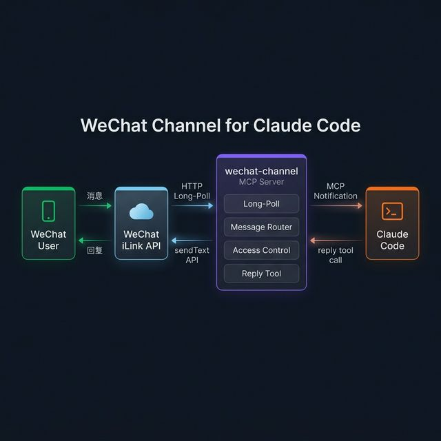
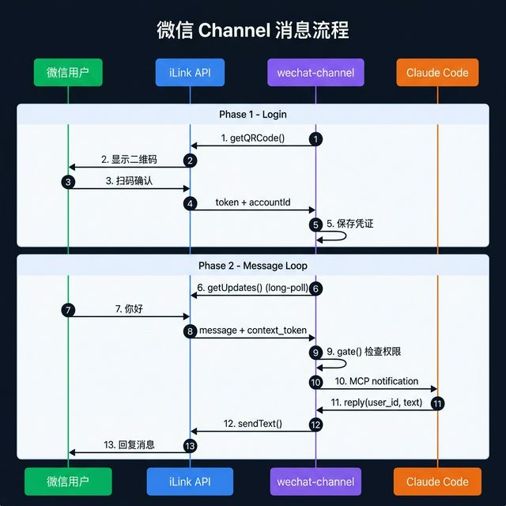
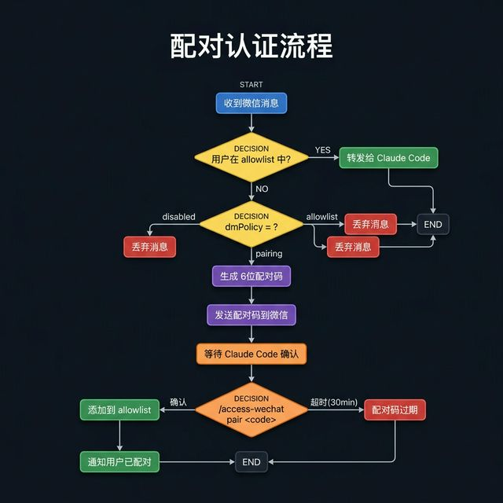

# WeChat Channel for Claude Code

通过微信 iLink 协议将微信消息接入 Claude Code。

## 架构



## 消息流程



## 安装

```bash
git clone https://github.com/你的用户名/claude-code-wechat-channel.git wechat-channel
cd wechat-channel
./setup.sh
```

`setup.sh` 会自动：
- 检测 bun 路径
- 克隆并构建 `wechat-ilink-client`（如需要）
- 安装依赖
- 生成 `.mcp.json`（包含当前机器的绝对路径）

## 使用

### 1. 扫码登录

```bash
bun login.ts
```

终端会显示二维码，用微信扫码确认。凭证保存在 `~/.claude/channels/wechat/credentials.json`。

### 2. 启动 Claude Code

```bash
claude --add-dir ./ --dangerously-load-development-channels server:wechat
```

### 3. 收发消息

- 微信用户发消息 → Claude Code 自动收到
- Claude 用 `reply` 工具回复 → 微信用户收到

### 4. 配对（首次）

首次收到陌生用户消息时，会自动回复配对码。
在 Claude Code 中确认：

```
/access-wechat pair <code>
```



## 文件说明

| 文件 | 说明 |
|------|------|
| `server.ts` | MCP Server 核心 |
| `login.ts` | 独立扫码登录脚本 |
| `test-recv.ts` | 消息接收测试脚本 |
| `setup.sh` | 自动安装脚本 |
| `.mcp.json` | Claude Code 插件注册（由 setup.sh 生成） |

## 状态文件

保存在 `~/.claude/channels/wechat/`：

| 文件 | 说明 |
|------|------|
| `credentials.json` | 微信登录凭证 |
| `sync-buf.json` | 同步游标（断线恢复） |
| `access.json` | 配对/授权配置 |
| `debug.log` | 调试日志 |
| `inbox/` | 接收的图片文件 |

## 注意事项

- ⚠️ 建议使用**小号**测试，不要用主力微信号
- iLink 协议来自微信官方平台，但客户端库 `wechat-ilink-client` 是社区维护
- Session 会过期，过期后需重新运行 `bun login.ts` 扫码
- 微信有消息频率限制，长文本会自动分块发送

## License

MIT
